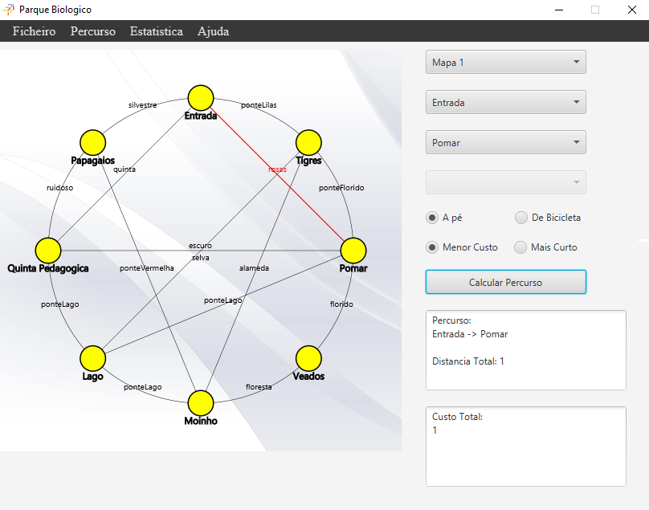
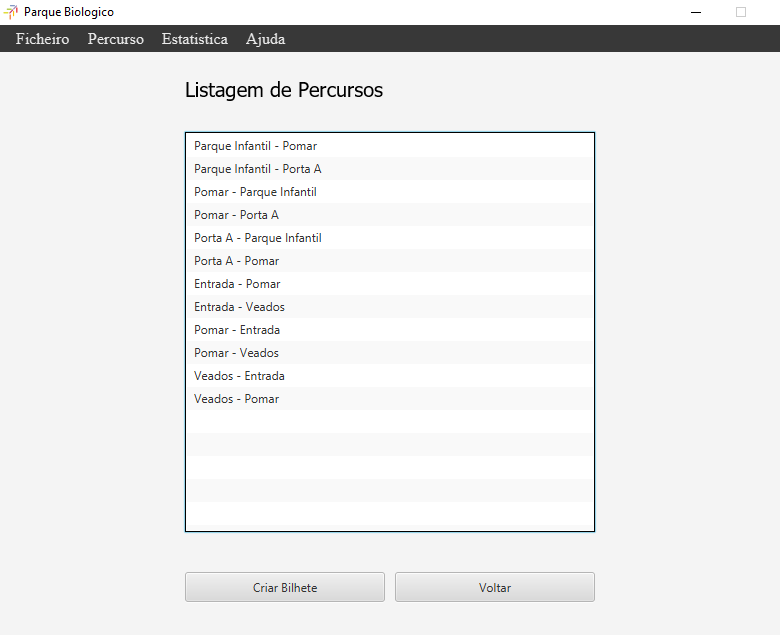
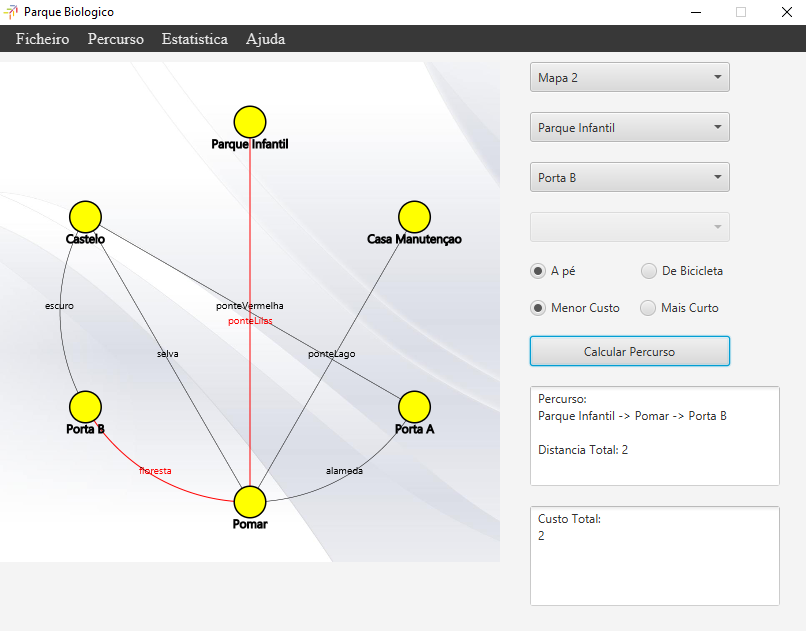

# ParqueBiologico

### Descrição
Pretende-se desenvolver uma aplicação que permita calcular percursos a pé e de bicicleta dentro
de um parque biológico. A aplicação disponibiliza informação sobre o preço total a pagar pelo
percurso selecionado e permite ainda a emissão de bilhetes e respetiva fatura.
O parque biológico é constituído por vários pontos de interesses, pontos esses que estão conectados
ou por caminhos, ou por pontes, os caminhos podem ser percorridos em qualquer sentido, mas as
pontes só podem ser percorridas num dos sentido. Existem ainda conexões que não permitem a
circulação de bicicletas. Cada conexão tem um custo, e uma distancia associada.
Cada percurso inicia e termina no ponto de entrada do parque, e poderá passar por vários pontos
de interesse selecionados pelo utilizador. O utilizador deverá poder calcular o seu percurso de forma
a minimizar a distancia, ou o custo do mesmo.

